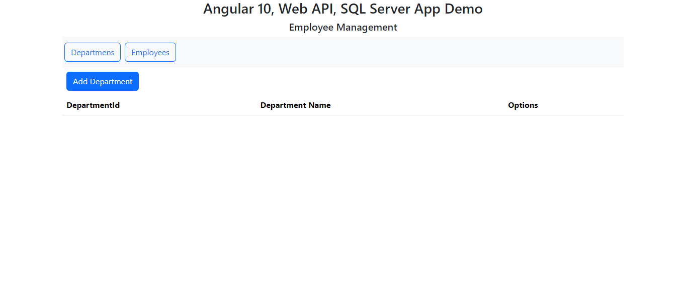

# Department and Employee Management

This is a fullstack project builded using Django API + Angular 16 + SQLite. The main purpose this project is to show a easy way for add, edit and delete records about employees and his departments. In this repository are the **frontend files**.

# Setup

* Do the download/clone this project
* Install the angular 16
	>npm install -g @angular/cl@16
* Run the command:
	
	> ng serve --open
* You should see this site:

